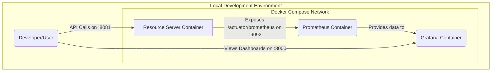

# Spring Boot Security & Observability Lab

This repository is a hands-on lab designed to demonstrate the architectural evolution of a modern Java application. We will build a system from the ground up, starting with a secure monolith and progressively refactoring it into a fully observable, distributed system using cloud-native best practices.

---

## Lab Progress: Phase 2 - Observing the Monolith

The `main` branch currently represents the completed state of **Phase 2**.

*   **Git Tag for this Phase:** `v2.0-observable-monolith`

### Objective

The goal of this phase was to take the secure monolith from Phase 1 and instrument it with a modern observability stack. We have containerized the entire system and can now launch the application, a metrics database (Prometheus), and a visualization platform (Grafana) with a single command. The focus is on gaining deep, real-time insight into the application's performance and behavior.

### Key Concepts Demonstrated

*   **Application Instrumentation:** Using Spring Boot Actuator and Micrometer to expose detailed application metrics.
*   **Custom Metrics:** Creating custom `Counter` beans to track specific, high-value business events (e.g., login success vs. failure).
*   **Containerization:** Building a minimal, secure, and efficient multi-stage `Dockerfile` for the Spring Boot application.
*   **Infrastructure as Code (IaC):** Defining and orchestrating a multi-service environment using a single `docker-compose.yml` file.
*   **Metrics Pipeline:** Configuring Prometheus to automatically discover, authenticate with, and scrape the metrics from our application's secured management endpoint.
*   **Automated Provisioning:** Using Grafana's provisioning feature to automatically configure its data source and load a pre-built dashboard from version-controlled files.
*   **Profile-Specific Code:** Isolating non-production, demonstration code (`ChaosController`) using Spring Profiles.

### Architecture Overview

The architecture for Phase 2 is a containerized, multi-service stack. The `docker-compose.yml` file is the blueprint for this environment.



1.  **[Resource Server](resource-server):** Our Spring Boot application, now running inside a Docker container. It exposes its business API on port `8081` and its secured management/metrics API on a separate port, `9092`.
2.  **[Prometheus](config/prometheus/prometheus.yml):** The time-series database. It is configured to periodically scrape the `/actuator/prometheus` endpoint on our application container, authenticating with Basic Auth.
3.  **[Grafana](config/grafana):** The visualization platform. On startup, it is automatically provisioned with a connection to the Prometheus service and a pre-built "Resource Server Overview" dashboard.

---

## Local Development & Quick Start

**Prerequisites:** Docker and Docker Compose (or a compatible tool like Colima) must be installed.

1.  **Create your local environment file:**
    Copy the provided template to create your local `.env` file.
    ```bash
    cp .env.example .env
    ```
    *(Review the `.env` file and ensure the pre-filled secrets are suitable for your local development.)*

2.  **Build and run the entire stack:**
    From the project root, run the Docker Compose `up` command.
    ```bash
    docker-compose up --build
    ```    
    This will build the application's Docker image and start all three services (`resource-server`, `prometheus`, `grafana`).

3.  **Access the Services:**
    *   **Application API:** `http://localhost:8081`
    *   **Prometheus UI:** `http://localhost:9090`
    *   **Grafana UI:** `http://localhost:3000` (Login with `admin`/`admin`)

---

## API & Observability Usage Examples

#### 1. Generate Metrics

To see interesting data on your Grafana dashboard, you need to generate some traffic.

*   **Authenticate and get a token** (same as Phase 1):
    ```bash
    TOKEN=$(curl -s -X POST http://localhost:8081/auth/login \
    -H "Content-Type: application/json" \
    -d '{"username":"user", "password":"password"}' | jq -r .jwtToken)
    ```
*   **Call the secure endpoint:**
    ```bash
    curl http://localhost:8081/api/secure/data -H "Authorization: Bearer $TOKEN"
    ```
*   **Call the Chaos Demo endpoint** (multiple times to see variable results):
    ```bash
    curl http://localhost:8081/demo/flaky-request -H "Authorization: Bearer $TOKEN"
    ```

#### 2. View the Dashboard

1.  Navigate to Grafana at `http://localhost:3000`.
2.  Log in (`admin`/`admin`).
3.  Go to the "Dashboards" section.
4.  Open the pre-provisioned **"Resource Server Overview"** dashboard.
5.  Observe the panels update in real-time as you generate more API traffic.

#### 3. Stop the Environment

When you are finished, stop all services and remove the containers.
```bash
docker-compose down
```