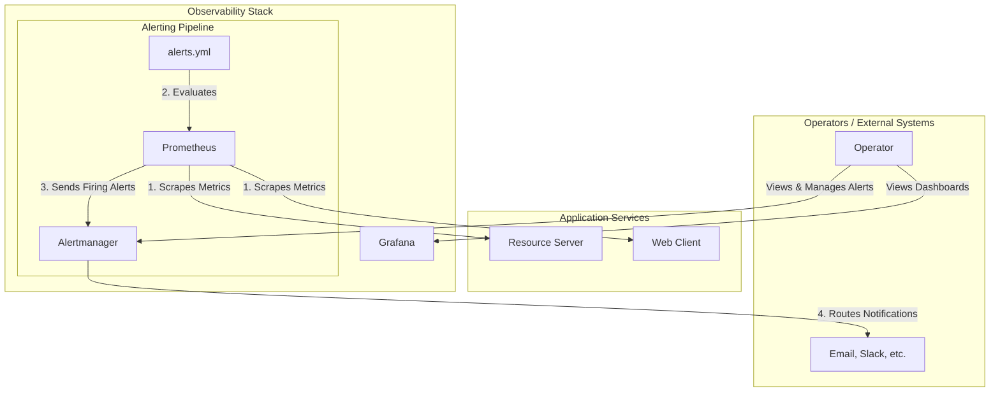

# Spring Boot Security & Observability Lab

This repository is a hands-on lab designed to demonstrate the architectural evolution of a modern Java application. We will build a system from the ground up, starting with a secure monolith and progressively refactoring it into a fully observable, distributed system using cloud-native best practices.

---

## Lab Progress: Phase 6 - Proactive Alerting with Alertmanager

The `main` branch currently represents the completed state of **Phase 6**.

*   **Git Tag for this Phase:** `v6.0-proactive-alerting`

### Objective

The goal of this phase was to transition our monitoring strategy from passive (dashboards) to **proactive**. We have integrated the Prometheus Alertmanager into our stack to create a system that can automatically detect and route notifications about problems, without requiring a human to be watching a screen. This demonstrates the completion of a production-grade monitoring feedback loop.

### Key Concepts Demonstrated

*   **Prometheus Alerting Pipeline:** Understanding the distinct roles of Prometheus (which evaluates rules and generates alerts) and Alertmanager (which receives, de-duplicates, groups, and routes alerts).
*   **Declarative Alerting Rules:** Defining alerting conditions as code using PromQL expressions in a version-controlled YAML file.
*   **Alerting on Technical & Security Metrics:** Creating two distinct types of alerts:
    1.  A **technical alert** (`ApiServerErrorRateHigh`) that fires on infrastructure-level signals like a spike in 5xx server errors.
    2.  A **security alert** (`UnauthorizedAdminAccessSpike`) that fires on application-level signals, such as an abnormal rate of `4xx` errors on a privileged endpoint.
*   **Alert Lifecycle:** Observing the full lifecycle of an alert: `Inactive` -> `Pending` -> `Firing` -> `Resolved`.
*   **UI-Driven Test Harness:** Building a dedicated "Alerting Test Panel" in our web application to reliably trigger alert conditions on demand, proving the entire pipeline works end-to-end.

### Architecture Overview

Phase 6 introduces Alertmanager and connects it to our existing Prometheus instance. The data flow for alerting is now a core part of our observability stack.



1.  **[Prometheus](config/prometheus/prometheus.yml):** Its role is expanded. It is now configured to load a [rule file](config/prometheus/alerts.yml) and to send any alerts that become "Firing" to the Alertmanager service. The `--web.external-url` flag is set to ensure backlinks are generated with a browser-resolvable hostname.
2.  **[Alertmanager](config/alertmanager/alertmanager.yml):** The new central hub for all alerts. It receives alerts from Prometheus, groups them to reduce noise, and would (in a production setup) route them to configured receivers. For this lab, we use a "null" receiver.

---

### Key Configuration Details

#### 1. Prometheus Alert Rules

The core of this phase is the [alerts.yml](config/prometheus/alerts.yml) file. We have defined two rules that are specifically tailored for our application and optimized for a lab environment with short `for` durations for rapid testing.

*   **`ApiServerErrorRateHigh`:** This rule fires when the rate of `5xx` status codes from the `resource-server` exceeds 0 for a continuous period. It is designed to be triggered by our `ChaosController`.
*   **`UnauthorizedAdminAccessSpike`:** This security-focused rule fires when the rate of `4xx` status codes on the specific `/api/secure/admin` endpoint exceeds 0. This is more robust than checking for just `403` as it captures any client-side error on this privileged endpoint, signaling a potential issue.

#### 2. UI-Driven Test Harness

To validate the entire alerting pipeline, we implemented a dedicated "Alerting Test Panel" in the `web-client`.
*   The `ChaosController` in the `resource-server` was enhanced with a guaranteed-failure endpoint (`/api/chaos/error`).
*   The `WebController` in the `web-client` was updated with two new `POST` endpoints that call the backend to generate `5xx` and `4xx` errors.

---

## Local Development & Quick Start

The prerequisites and setup are the same as in previous phases.

1.  **Configure Local Hostnames (One-Time Setup, if not already done):**
    Edit your local `hosts` file to add:
    ```
    127.0.0.1   keycloak.local
    ```
2.  **Create and Configure Your Environment File:**
    ```bash
    cp .env.example .env
    # ...then edit .env to add your WEB_CLIENT_SECRET from Keycloak.
    ```
3.  **Build and run the entire stack:**
    ```bash
    docker-compose up --build -d
    ```
4.  **Access the Services:**
    *   **Web Client Application:** [http://localhost:8082](http://localhost:8082) (Login with `lab-user`/`lab-user` or `lab-admin`/`lab-admin`)
    *   **Keycloak Admin Console:** [http://keycloak.local](http://keycloak.local) (Login with `admin`/`admin`)
    *   **Prometheus UI:** [http://localhost:9090](http://localhost:9090)
    *   **Alertmanager UI:** [http://localhost:9093](http://localhost:9093)
    *   **Grafana UI:** [http://localhost:3000](http://localhost:3000)

---

## Validating the New Alerting Features

1.  **Confirm Rules are Loaded:**
    *   Navigate to the Prometheus UI's "Alerts" tab ([http://localhost:9090/alerts](http://localhost:9090/alerts)).
    *   Verify that both new alerts are present and in the green "Inactive" state.

2.  **Trigger the Alerts via the UI:**
    *   Log in to the Web Client as **`lab-user` / `lab-user`**.
    *   In the "Alerting Test Panel", repeatedly click the buttons to generate `403` and `5xx` errors.
    *   Watch the Prometheus Alerts UI. The alerts will transition from `Inactive` to `Pending` (yellow) and then to `Firing` (red).
    *   Once firing, the alerts will appear in the Alertmanager UI.

#### Stop the Environment

```bash
docker-compose down -v
```