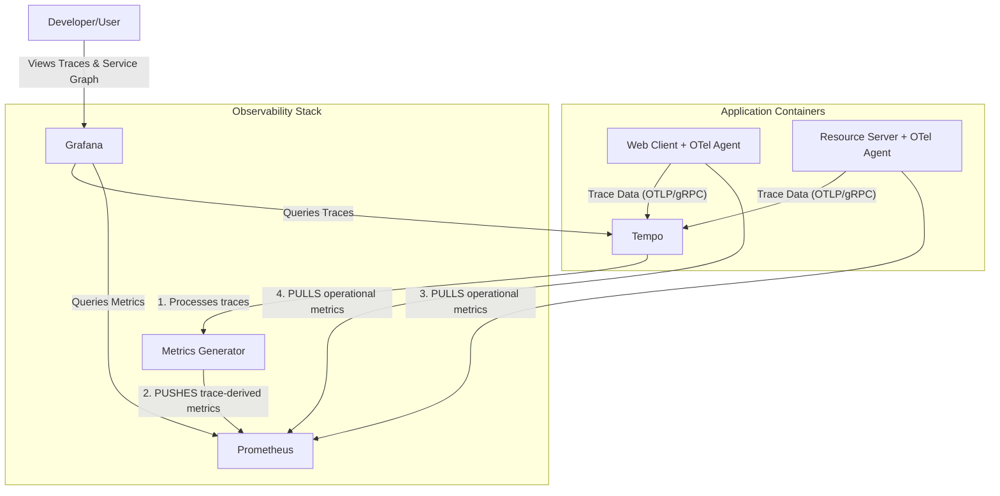

# Spring Boot Security & Observability Lab

This repository is a hands-on lab designed to demonstrate the architectural evolution of a modern Java application. We will build a system from the ground up, starting with a secure monolith and progressively refactoring it into a fully observable, distributed system using cloud-native best practices.

---

## Lab Progress: Phase 4 - Tracing a Distributed System

The `main` branch currently represents the completed state of **Phase 4**.

*   **Git Tag for this Phase:** `v4.0-distributed-tracing`
*   **Key Pull Request for this Phase:** [#10 - feat(observability): implement distributed tracing with OpenTelemetry](https://github.com/apenlor/spring-boot-security-observability-lab/pull/10)

### Objective

The goal of this phase was to complete the "three pillars of observability" by adding **distributed tracing**. We have instrumented our services to generate trace data, allowing us to gain end-to-end visibility of a single request as it travels from the user's browser, through the `web-client`, and into the backend `resource-server`. This transforms our monitoring from service-level metrics to transaction-level insights.

### Key Concepts Demonstrated

*   **Agent-Based Auto-Instrumentation:** Using the OpenTelemetry Java Agent to instrument our Spring Boot applications with zero code changes.
*   **Distributed Context Propagation:** Understanding how the W3C Trace Context (`traceparent` header) is automatically propagated between services to link individual spans into a single, cohesive trace.
*   **Trace Visualization:** Storing and visualizing traces in Grafana Tempo, including the parent-child relationships between spans in a waterfall diagram.
*   **Service Graph Generation:** Configuring Tempo's `metrics_generator` to process trace data and automatically generate the metrics required to build a live service graph, visualizing the topology and dependencies of our system.
*   **Hybrid PUSH/PULL Metrics Architecture:** Implementing the official, production-grade pattern where Tempo **pushes** trace-derived metrics to Prometheus via `remote_write`, while Prometheus continues to **pull** operational metrics from other services via scraping.
*   **Anatomy of a Trace:** Identifying and analyzing the core components of a trace (TraceID, Span, SpanID, Parent SpanID) within the Grafana UI.

### Architecture Overview

Phase 4 introduces Grafana Tempo as the tracing backend and integrates it deeply with our existing observability stack. The OpenTelemetry agent is attached to each Java service to produce and send trace data.



1.  **[OpenTelemetry Agent](config/otel/opentelemetry-javaagent.jar):** A Java agent attached to both the `web-client` and `resource-server` at startup. It automatically instruments common frameworks (like Spring Web MVC and `WebClient`) to create spans and propagate the trace context.
2.  **[Grafana Tempo](config/tempo/tempo.yml):** Our new tracing backend. It ingests trace data via the OTLP protocol, stores it, and makes it queryable by Grafana.
3.  **Metrics Generator:** A component within Tempo that is now configured to process these traces in the background. It generates aggregate metrics (request counts, latency, errors) that are essential for building the service graph.
4.  **Prometheus & Grafana:** Their roles are enhanced. Prometheus now receives metrics *pushed* from Tempo in addition to its regular scraping. Grafana's Tempo data source is linked to its Prometheus data source, allowing it to correlate traces with metrics and render the service graph.

---

## Local Development & Quick Start

The prerequisites and startup process are the same as Phase 3.

1.  **Configure Local Hostnames (If you haven't already):**
    Ensure your `/etc/hosts` file contains `127.0.0.1   keycloak.local`.

2.  **Build and run the entire stack:**
    From the project root, run the Docker Compose `up` command.
    ```bash
    docker-compose up --build -d
    ```

---

## Usage Example: Viewing a Distributed Trace

1.  **Generate a Trace:**
    *   Navigate to the web client at `http://localhost:8082`.
    *   Log in (e.g., `lab-user`/`lab-user`).
    *   Click the **"Fetch Secure Data from API"** button a few times. This action creates a request that travels from the `web-client` to the `resource-server`.

2.  **Find the Trace in Grafana:**
    *   Navigate to Grafana at `http://localhost:3000`.
    *   Go to the **Explore** view (compass icon on the left).
    *   Select the **Tempo** data source from the dropdown at the top.
    *   In the "Search" panel, select `web-client` from the "Service Name" dropdown and click "Run query".
    *   Find and click on a trace named **`GET /fetch-data`**.

3.  **Analyze the Trace Waterfall:**
    You will see a diagram showing the parent span from the `web-client` and, nested underneath it, the child span from the `resource-server`, proving the end-to-end trace was captured successfully.

4.  **View the Service Graph:**
    *   While still in the Tempo Explore view, click the **"Service Graph"** tab.
    *   After waiting a minute for the metrics to generate and be scraped, the graph will appear, visually confirming the dependency between the `web-client` and `resource-server`.