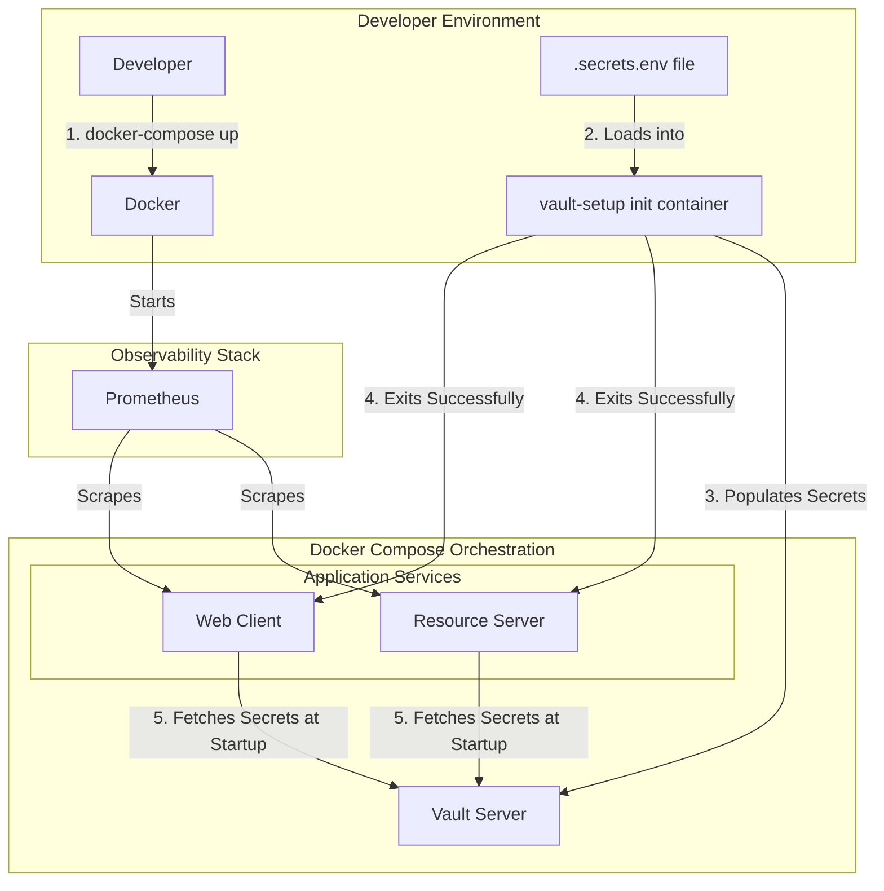

# Spring Boot Security & Observability Lab

This repository is a hands-on lab designed to demonstrate the architectural evolution of a modern Java application. We
will build a system from the ground up, starting with a secure monolith and progressively refactoring it into a fully
observable, distributed system using cloud-native best practices.

---

## Lab Progress: Phase 8 - Advanced Secret Management with HashiCorp Vault

The `main` branch currently represents the completed state of **Phase 8**.

* **Git Tag for this Phase:** `v8.0-advanced-secret-management`

### Objective

The goal of this phase was to elevate our security posture to a production-grade standard by **eliminating all
application secrets from configuration files and environment variables**. We have integrated **HashiCorp Vault** as a
centralized, secure, and dynamic secrets management engine. Our applications now fetch their sensitive credentials at
startup from a secure, authenticated, and external source. This demonstrates a critical pattern for building highly
secure, cloud-native systems.

### Key Concepts Demonstrated

* **Secrets as a Service:** Transitioning from a static configuration model (secrets in `.env` or properties files) to a
  dynamic one where secrets are fetched from a dedicated, secure API (Vault).
* **Centralized Secrets Management:** Using Vault as the single source of truth for all application-level secrets (
  `client-secret`, `actuator` credentials), enabling centralized auditing, rotation, and access control.
* **The "First Secret" Problem:** Documenting and understanding the different approaches for an application to securely
  authenticate with Vault. We use a simple token for the lab while clearly documenting the production-grade **AppRole**
  pattern.
* **Automated Secrets Population:** Creating a fully automated, idempotent **init container** (`vault-setup`) that runs
  on `docker-compose up`. This container uses the Vault CLI to populate the necessary secrets, providing a true
  one-command startup experience for developers.
* **Spring Cloud Vault Integration:** Using the `spring.config.import=vault://` property to seamlessly integrate our
  Spring Boot applications with Vault, making secrets available in the Spring `Environment`.
* **Test Isolation from Vault:** Refactoring our entire test suite to be fully isolated from Vault. This was achieved by
  overriding the `spring.config.import` property and disabling the `VaultHealthIndicator` in the test-specific property
  files, ensuring a stable and reliable CI/CD pipeline.
* **Separation of Concerns:** A key architectural decision was made to distinguish between **application secrets** (
  which now live in Vault) and **infrastructure secrets** (like Prometheus's scrape credentials, which remain in `.env`
  files). This is a clean, professional pattern.

### Architecture Overview

Phase 8 introduces HashiCorp Vault into our stack and creates a new, automated setup flow. The applications now have a
critical dependency on Vault at startup.



1. **[HashiCorp Vault](docker-compose.yml):** A new container running Vault in development mode. It is configured with a
   predictable root token to simplify lab setup.
2. **[vault-setup container](docker-compose.yml):** This new, short-lived service is the key to automation. It uses the
   official `vault` image, runs our [`populate-vault.sh`](scripts/populate-vault.sh) script, and exits. The application
   services are configured with a `depends_on` condition to wait for this service to complete successfully.
3. **[Spring Boot Applications](resource-server/src/main/resources/application.properties):** Both services now use the
   `spring.config.import=vault://` property to connect to Vault and fetch secrets at boot time. Placeholders like
   `${actuator.username}` and `${client-secret}` are resolved from properties loaded from Vault.

---

### Key Configuration Details

#### 1. Automated Secrets Population

The core of the new automated flow is the [`vault-setup`](docker-compose.yml) service. It is configured to read from a
new, git-ignored `.secrets.env` file, which is the single source of truth for application secrets in the development
environment.

The [`populate-vault.sh`](scripts/populate-vault.sh) script it runs is now a network-native, POSIX-compliant script that
uses the Vault CLI to communicate with the Vault server over the Docker network, removing any dependency on the Docker
socket.

#### 2. Spring Cloud Vault Configuration

We have adopted the current configuration approach recommended by Spring. Instead of a `bootstrap.yml` file, all Vault
configuration is now cleanly located in the main `application.properties` file for each service.

```properties
# In application.properties
spring.config.import=vault://
spring.cloud.vault.uri=http://vault:8200
spring.cloud.vault.token=dev-root-token
spring.cloud.vault.kv.enabled=true
spring.cloud.vault.kv.application-name=${spring.application.name}
```

---

## Local Development & Quick Start

The setup process now clearly separates infrastructure configuration from application secrets.

1. **Configure Infrastructure (One-Time Setup):**
    * Edit your local `hosts` file: `127.0.0.1 keycloak.local`
    * Create your infrastructure environment file: `cp .env.example .env`

2. **Configure Application Secrets (One-Time Setup):**
    * Create your application secrets file: `cp .secrets.env.example .secrets.env`
    * Edit `.secrets.env` to set your `WEB_CLIENT_SECRET`.
    
    * **How to get the `WEB_CLIENT_SECRET`:**
      - After starting the stack for the first time (`docker-compose up -d`), navigate to the **Keycloak Admin Console**
         at [http://keycloak.local](http://keycloak.local).
      - Log in with the admin credentials (`admin`/`admin`).
      - Ensure you are in the `observability-lab` realm (use the dropdown in the top-left corner).
      - Navigate to **Clients** in the left-hand menu.
      - Click on the `web-app-client`.
      - Go to the **Credentials** tab.
      - You will see a "Client secret" field. Click the "copy" icon to copy the secret value.
      - Paste this value into your `.secrets.env` file:
         ```dotenv
         # .secrets.env
         # Keycloak Web Client Credentials
         WEB_CLIENT_SECRET=PASTE_YOUR_COPIED_SECRET_HERE
         ```

3. **Build and run the entire stack with one command:**
   ```bash
   docker-compose up --build -d
   ```
   The `vault-setup` container will run automatically, populate Vault, and then the applications will start.

4. **Access the Services:**
    * **Web Client Application:** [http://localhost:8082](http://localhost:8082) Login with `lab-user`/`lab-user` or
      `lab-admin`/`lab-admin`)
    * **Vault UI:** [http://localhost:8200](http://localhost:8200) (Login with token: `dev-root-token`)
    * **Keycloak Admin Console:** [http://keycloak.local](http://keycloak.local) (Login with `admin`/`admin`)
    * **Traefik Dashboard:** [http://localhost:8080](http://localhost:8080)
    * **Prometheus UI:** [http://localhost:9090](http://localhost:9090)
    * **Grafana UI:** [http://localhost:3000](http://localhost:3000) (Login with `admin`/`admin`)

---

## Validating the New Secrets Management Features

1. **Verify Secrets in Vault:**
    * Navigate to the Vault UI at [http://localhost:8200](http://localhost:8200). 
    * Login with the token `dev-root-token`.
    * Navigate to the `secret/` path. You should see two entries: `resource-server` and `web-client`.
    * Click on them to verify that the secrets from your `.secrets.env` file have been correctly populated.

2. **Perform a Full End-to-End Test:**
    * Log in to the Web Client application at [http://localhost:8082](http://localhost:8082).
    * **Successful login and redirection to the dashboard is definitive proof** that the `web-client` successfully
      fetched its `client-secret` from Vault.

3. **Verify Actuator Security:**
    * Navigate to the Prometheus UI's "Targets" page: [http://localhost:9090/targets](http://localhost:9090/targets).
    * **Verify that the `resource-server` and `web-client` jobs are UP.** This proves that the applications successfully
      fetched their `actuator` credentials from Vault and that Prometheus is able to use its own credentials to scrape
      them.

#### Stop the Environment

```bash
docker-compose down -v
```