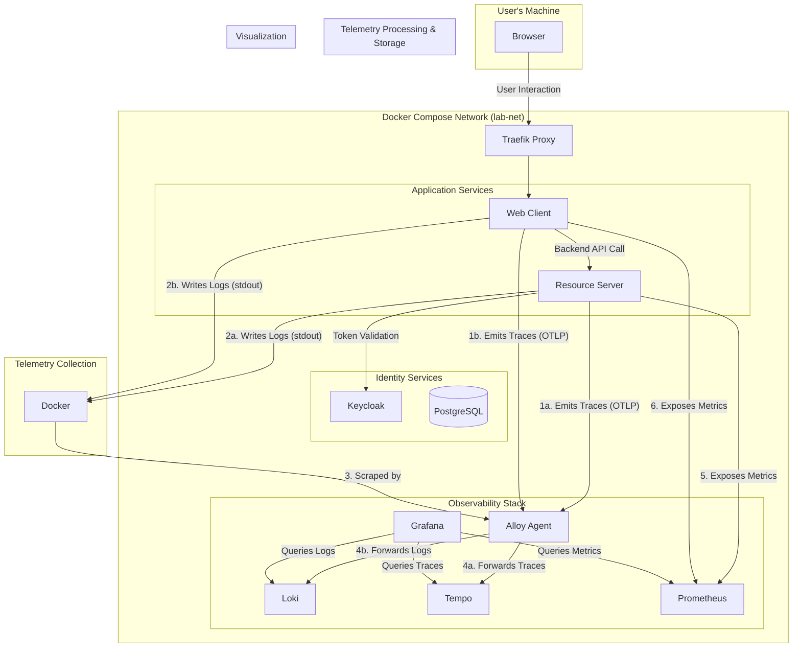

# Spring Boot Security & Observability Lab

This repository is a hands-on lab designed to demonstrate the architectural evolution of a modern Java application. We will build a system from the ground up, starting with a secure monolith and progressively refactoring it into a fully observable, distributed system using cloud-native best practices.

---

## Lab Progress: Phase 5 - Correlated Logs & Access Auditing

The `main` branch currently represents the completed state of **Phase 5**.

*   **Git Tag for this Phase:** `v5.0-correlated-logs-auditing`

### Objective

The goal of this phase was to complete the "three pillars of observability" by introducing a centralized, structured logging pipeline. We have also added a critical security layer by implementing a non-invasive, AOP-based audit logging mechanism. The system is now not only fully observable (metrics, traces, and logs), but all three pillars are correlated, allowing for seamless navigation from a distributed trace directly to the logs generated during that specific transaction.

### Key Concepts Demonstrated

*   **Centralized Logging:** Introducing Grafana Loki as a scalable, efficient log aggregation system.
*   **Unified Telemetry Collection:** Adopting Grafana Alloy as the modern, state-of-the-art agent for collecting **both logs and traces**, replacing older, single-purpose agents.
*   **Docker Service Discovery:** Configuring Alloy to use the Docker socket to automatically discover and scrape logs from all running containers, creating a "zero-touch" logging pipeline that scales automatically.
*   **Trace-to-Log Correlation:** Configuring Grafana to provide one-click navigation from a trace span in Tempo to the exact logs in Loki that correspond to that trace ID.
*   **Structured JSON Logging:** Ensuring all application logs are emitted as single-line, machine-readable JSON, a critical prerequisite for reliable parsing and querying.
*   **Aspect-Oriented Programming (AOP):** Creating a shared `lab-aspects` module to implement cross-cutting concerns without modifying business logic.
*   **Custom Audit Logs & Metrics:** Building `@Auditable` aspect that generates rich, structured audit logs and corresponding Micrometer metrics (`Counter` and `Timer`) for security monitoring and alerting.
*   **Multi-Module Maven Project:** Refactoring the build to support a shared library module and creating robust, multi-module-aware `Dockerfiles`.

### Architecture Overview

Phase 5 enriches our distributed system with a complete, correlated observability pipeline managed by Grafana Alloy.



1.  **[Grafana Loki](config/loki/loki-config.yml):** The new log storage backend. It is configured to run in a simple, single-tenant mode and stores its data in a persistent Docker volume.
2.  **[Grafana Alloy](config/alloy/alloy-config.river):** The new heart of our collection pipeline. It performs two critical functions:
    *   **Log Collection:** It connects to the Docker socket to discover our running application containers, scrapes their `stdout` log streams, and forwards them to Loki.
    *   **Trace Collection:** It acts as an OTLP endpoint, receiving traces from our applications' Java agents and forwarding them to Tempo.

---

### Key Configuration Details

#### 1. Grafana Alloy & Docker Service Discovery

To achieve a fully automated logging pipeline the `alloy` service in our `docker-compose.yml` mounts the host's Docker socket (`/var/run/docker.sock`) in read-only mode.

This is a privileged operation, and the decision to use it is a deliberate architectural trade-off, as documented in the `docker-compose.yml`'s security disclaimer.
*   **Benefit:** Alloy can query the Docker API to automatically discover every container on our project's network. It gets rich metadata like the `container_name` for free, which it uses to create labels in Loki. This means we can add new services, and our logging pipeline will **automatically start collecting their logs** with zero configuration changes.
*   **Mitigation:** The risk is managed by using the official, minimalist Grafana Alloy image and mounting the socket as **read-only**. Anyway, not recommendable for production environments.

The [Alloy configuration](config/alloy/alloy-config.river) is written in the River (`.river`) language and defines a clear pipeline: discover Docker containers, filter them by our project's network, relabel them with a clean `container_name`, and forward their logs to Loki.

#### 2. AOP-based Audit Logging

To handle security auditing as a cross-cutting concern, we introduced a new, shared Maven module: [`lab-aspects`](lab-aspects).
*   This module contains a custom `@Auditable` annotation and the `AuditLogAspect`.
*   The aspect intercepts any method marked with `@Auditable` and performs two actions:
    1.  **Logs a Structured Event:** It uses SLF4J's Fluent API to create a rich, nested JSON object containing detailed context about the event (principal, roles, outcome, duration, sanitized request details, and exception info). These are logged to a dedicated `AUDIT` logger.
    2.  **Emits Metrics:** It records a `Counter` (`app.audit.events.total`) and a `Timer` (`app_audit_events_duration_seconds`) for every audit event. These metrics are tagged with low-cardinality labels (`method`, `outcome`), making them perfect for building high-performance dashboards and alerts.

This implementation is fully tested with its own integration test suite, which validates every feature, including the metric emission and context handling.

---

## Local Development & Quick Start

The prerequisites and setup are the same as in previous phases.

1.  **Configure Local Hostnames (One-Time Setup, if not already done):**
    Edit your local `hosts` file to add:
    ```
    127.0.0.1   keycloak.local
    ```
2.  **Create and Configure Your Environment File:**
    ```bash
    cp .env.example .env
    # ...then edit .env to add your WEB_CLIENT_SECRET from Keycloak.
    ```
3.  **Build and run the entire stack:**
    ```bash
    docker-compose up --build -d
    ```
4.  **Access the Services:**
    * **Web Client Application:** [http://localhost:8082](http://localhost:8082) (Login with `lab-user`/`lab-user` or
      `lab-admin`/`lab-admin`)
    * **Keycloak Admin Console:** [http://keycloak.local](http://keycloak.local) (Login with `admin`/`admin`)
    * **Traefik Dashboard:** [http://localhost:8080](http://localhost:8080)
    * **Prometheus UI:** [http://localhost:9090](http://localhost:9090)
    * **Grafana UI:** [http://localhost:3000](http://localhost:3000) (Login with `admin`/`admin`)
---

## Validating the New Observability Features

1.  **Generate Traffic:** Log in to the web client as `lab-user`/`lab-user` and click the "Call Secure API" and "Call Admin API" buttons several times.

2.  **Validate Audit Logs:**
    *   In Grafana, go to Explore -> Loki.
    *   Run the query: `{container_name="resource-server"} | json | logger_name="AUDIT"`
    *   Inspect the logs. You will see the structured `audit` object with `outcome="SUCCESS"` for successful calls and `outcome="FAILURE"` for the denied admin call.

3.  **Validate Audit Metrics:**
    *   In Grafana, go to Explore -> Prometheus.
    *   Run the query: `rate(app_audit_events_total{outcome="FAILURE"}[1m])`
    *   You should see the rate of failed audit events for the `getAdminData` method.

4.  **Validate Trace-to-Log Correlation:**
    *   Find a trace in Tempo for a `GET /fetch-data` operation.
    *   Click on the span for the `resource-server`.
    *   In the span details panel, a **blue "Logs for this span" button** will be visible.
    *   Clicking it will open Loki and show you the exact logs—including the audit log—for that specific trace.

#### Stop the Environment

```bash
docker-compose down -v
```