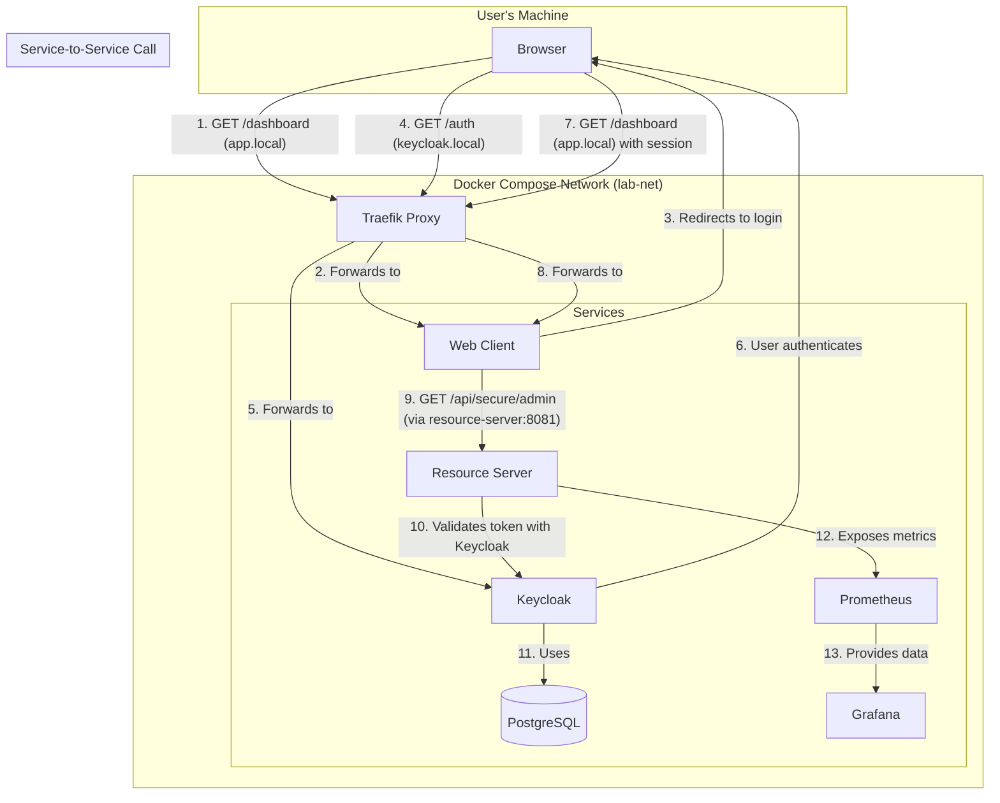

# Spring Boot Security & Observability Lab

This repository is a hands-on lab designed to demonstrate the architectural evolution of a modern Java application. We
will build a system from the ground up, starting with a secure monolith and progressively refactoring it into a fully
observable, distributed system using cloud-native best practices.

---

## Lab Progress: Phase 3 - Federated Identity & Multi-Service Architecture

The `main` branch currently represents the completed state of **Phase 3**.

* **Git Tag for this Phase:** `v3.0-federated-identity`

### Objective

The goal of this phase was to perform a major architectural evolution: moving from a self-contained security model to a
modern, **federated identity** pattern. We have introduced an external Identity Provider (Keycloak) and refactored our
system into two distinct services: a pure backend **Resource Server** and a new **Web Client** that handles user-facing
login flows. This is the standard architecture for secure, distributed systems.

### Key Concepts Demonstrated

* **Federated Identity (OAuth2/OIDC):** Delegating user authentication to a dedicated, centralized Identity Provider (
  Keycloak).
* **OAuth2 Resource Server:** Refactoring the backend API to a pure resource server whose only job is to validate JWTs
  issued by an external authority.
* **OAuth2 Client:** Building a new web application that implements the OIDC **Authorization Code Grant Flow** for
  secure, user-facing login.
* **Service-to-Service Security:** Implementing the **Client Credentials Grant** flow for secure, authenticated
  communication between the `web-client` and the `resource-server`.
* **Role-Based Access Control (RBAC):** Using Keycloak to manage user and service account roles, and enforcing them in
  the `resource-server` with Spring Security's `@PreAuthorize`.
* **Reverse Proxy Gateway:** Introducing a Traefik reverse proxy to provide a single, clean entry point for our identity
  provider, solving complex container networking issues for browser-based flows.
* **Infrastructure as Code (IaC):** All services, including Keycloak, PostgreSQL, and Traefik, are defined in
  `docker-compose.yml`. Keycloak's entire realm configuration is captured in a version-controlled JSON file for 100%
  automated, reproducible setup.
* **Robust Startup Orchestration:** Using Docker health checks to guarantee a stable startup order, eliminating race
  conditions between dependent services.

### Architecture Overview

Phase 3 introduces a distributed, multi-service architecture orchestrated by Docker Compose and fronted by a reverse
proxy.



1. **[Traefik](docker-compose.yml):** Our reverse proxy. It listens on port 80 and routes traffic based on hostname. It
   directs `keycloak.local` traffic to Keycloak.
2. **[Keycloak](docker-compose.yml):** Our external Identity Provider, backed by a PostgreSQL database. It is **fully
   pre-configured on startup** using a realm export file. See the "Keycloak Configuration" section below for details.
3. **[Web Client](web-client):** The new user-facing application. It handles the OIDC login flow and makes secure,
   backend API calls.
4. **[Resource Server](resource-server):** The original application, now refactored to only protect API endpoints by
   validating JWTs issued by Keycloak.

---

### Keycloak Configuration Details

A core principle of this lab is Infrastructure as Code. The entire Keycloak environment is configured automatically on
startup, requiring zero manual setup. This is achieved through three key mechanisms in our `docker-compose.yml`:

1. **Reverse Proxy with Traefik:** A Traefik container acts as a reverse proxy. This is the cornerstone of our
   networking solution, designed to solve the "split-horizon" problem where our browser (on the host) and our backend
   services (in containers) have different views of the network.
    * **The Problem:** When the `web-client` needs to log a user in, it must redirect the user's browser to Keycloak. If
      it redirects to the internal Docker address (`http://keycloak:8080`), the browser will fail as it cannot resolve
      that hostname. If Keycloak is configured to use `localhost`, then the inter-service JWT validation fails.
    * **The Solution:** We use a custom hostname, `keycloak.local`. Traefik is configured via Docker labels to listen
      for traffic directed to `keycloak.local` and route it to the `keycloak` container. This provides a single,
      consistent address. To make this hostname reachable from our host machine, a one-time update to the `/etc/hosts`
      file is required, as detailed in the "Local Development" section.
2. **Network Alias:** We use Docker's `networks.aliases` feature to make the Traefik proxy reachable at the
   `keycloak.local` hostname from any other container on our shared `lab-net` network. This provides a single,
   consistent URL for all services.
3. **Realm Export File:** We provide a complete realm definition in
   the [observability-lab-realm.json](config/keycloak/observability-lab-realm.json) file. When the Keycloak container
   starts, its `--import-realm` command automatically creates and configures our entire environment based on this file.

The realm export file defines:

* The **`observability-lab` Realm**.
* Two **Clients**:
    * `resource-server-api`: A "bearer-only" client representing our backend API.
    * `web-app-client`: A "confidential" client representing our user-facing web application, with the correct redirect
      URIs configured.
* Two **Users**:
    * `lab-admin` (password: `lab-admin`)
    * `lab-user` (password: `lab-user`)
* One **Realm Role**: `ADMIN`, which is assigned to the `lab-admin` user.
* **Service-to-Service Authorization**: A set of mappers on the `web-app-client` that ensure its service account token
  is correctly configured to be accepted by the `resource-server` and to contain the `ADMIN` role.

This automated setup ensures a perfectly consistent and reproducible environment for every developer, every time.

---

## Local Development & Quick Start

**Prerequisites:** Docker and Docker Compose must be installed. A **one-time setup** is required to configure local
domain names.

1. **Configure Local Hostnames (One-Time Setup):**
   You must edit your local `hosts` file to map our service domains to your local machine. This is required for your
   browser to correctly interact with the containerized services via the reverse proxy.
    * **On macOS / Linux:** Edit `/etc/hosts`
    * **On Windows:** Edit `C:\Windows\System32\drivers\etc\hosts` (with an administrator editor)

   Add the following line to the end of the file:
   ```
   127.0.0.1   keycloak.local
   ```

2. **Create and Configure Your Environment File:**
   Copy the provided template to create your local `.env` file.
   ```bash
   cp .env.example .env
   ```
   This file contains secrets that your Docker Compose stack will use. You must now add the `WEB_CLIENT_SECRET`.

   **How to get the `WEB_CLIENT_SECRET`:**
    1. After starting the stack for the first time (`docker-compose up -d`), navigate to the **Keycloak Admin Console**
       at [http://keycloak.local](http://keycloak.local).
    2. Log in with the admin credentials (`admin`/`admin`).
    3. Ensure you are in the `observability-lab` realm (use the dropdown in the top-left corner).
    4. Navigate to **Clients** in the left-hand menu.
    5. Click on the `web-app-client`.
    6. Go to the **Credentials** tab.
    7. You will see a "Client secret" field. Click the "copy" icon to copy the secret value.
    8. Paste this value into your `.env` file:
       ```dotenv
       # .env
       # ... other variables
       WEB_CLIENT_SECRET=PASTE_YOUR_COPIED_SECRET_HERE
       ```
    9. You may need to restart the `web-client` for it to pick up the new secret: `docker-compose restart web-client`.

3. **Build and run the entire stack:**
   ```bash
   docker-compose up --build -d
   ```
   This will build all application images and start all services. The `--build` flag ensures your latest code changes
   are included. The `-d` flag runs them in the background.

4. **Access the Services:**
    * **Web Client Application:** [http://localhost:8082](http://localhost:8082) (Login with `lab-user`/`lab-user` or
      `lab-admin`/`lab-admin`)
    * **Keycloak Admin Console:** [http://keycloak.local](http://keycloak.local) (Login with `admin`/`admin`)
    * **Traefik Dashboard:** [http://localhost:8080](http://localhost:8080)
    * **Prometheus UI:** [http://localhost:9090](http://localhost:9090)
    * **Grafana UI:** [http://localhost:3000](http://localhost:3000) (Login with `admin`/`admin`)

---

## Usage Example: The Full OIDC Flow

1. **Navigate to the Web Client:** Open your browser to `http://localhost:8082`.
2. **Log In:** Click the "Go to Dashboard" button. You will be redirected to the `keycloak.local` login page.
    * Log in as the admin user: `lab-admin` / `lab-admin`
    * Or log in as the regular user: `lab-user` / `lab-user`
3. **Access the Dashboard and Test Permissions:** You will be redirected back to the `web-client` dashboard. Both
   buttons will be visible for both users. This allows you to test the API-level security:
    * **As `lab-admin`:** Clicking **both** "Fetch Secure Data" and "Fetch Admin Data" will succeed.
    * **As `lab-user`:** Clicking "Fetch Secure Data" will succeed. Clicking "Fetch Admin Data" will correctly fail and
      display a **403 FORBIDDEN** error. This proves that our backend `resource-server` is correctly enforcing
      role-based security.
4. **Log Out:** Click the "Logout" button. This will perform a full OIDC federated logout, terminating both your
   application session and your Keycloak session.

#### Stop the Environment

```bash
docker-compose down -v
```