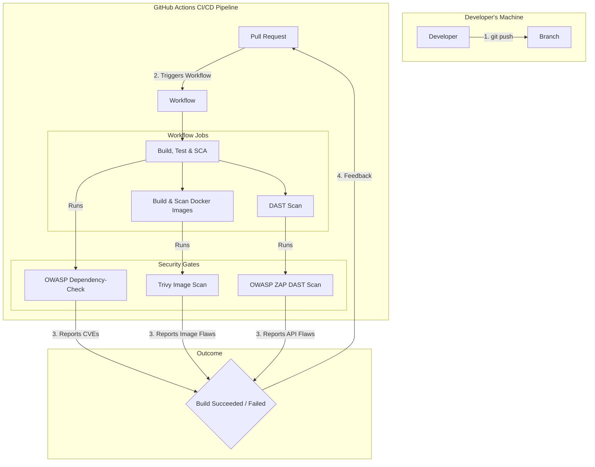

# Spring Boot Security & Observability Lab

This repository is a hands-on lab designed to demonstrate the architectural evolution of a modern Java application. We
will build a system from the ground up, starting with a secure monolith and progressively refactoring it into a fully
observable, distributed system using cloud-native best practices.

---

## Lab Progress: Phase 7 - Continuous Security Integration (DevSecOps)

The `main` branch currently represents the completed state of **Phase 7**.

* **Git Tag for this Phase:** `v7.0-continuous-security`

### Objective

The goal of this phase was to "shift left" security, embedding a comprehensive and automated security testing pipeline
directly into our CI/CD workflow. This phase transforms our development process from one where security is a manual or
late-stage activity into a true DevSecOps model, where security checks are an integral, automated part of every code
change. Build a high-assurance delivery pipeline that catches vulnerabilities early and automatically.

### Key Concepts Demonstrated

* **Multi-Layered Security Pipeline:** Implementing a defense-in-depth strategy with three distinct, automated security
  gates in our GitHub Actions workflow.
* **Software Composition Analysis (SCA):** Using the **OWASP Dependency-Check** Maven plugin to automatically scan all
  third-party libraries for known vulnerabilities (CVEs), addressing supply chain risk.
* **Container Image Scanning:** Using **Trivy** to scan our final Docker images (`resource-server`, `web-client`) for
  vulnerabilities in the underlying operating system and system libraries.
* **Dynamic Application Security Testing (DAST):** Using the **OWASP ZAP** baseline scanner to perform a live, running
  scan of the `resource-server`'s API contract, identifying runtime and configuration-related security issues.
* **API Contract Generation:** Integrating **SpringDoc OpenAPI** to automatically generate an OpenAPI v3 specification,
  providing a machine-readable contract for the DAST scanner.
* **Automated Security Gates:** Configuring the CI pipeline to **fail the build** if any of the scanners detect a high
  or critical severity vulnerability, creating an automated quality gate.
* **CI/CD Debugging & Remediation:** Demonstrating a realistic workflow of a security gate catching a legitimate
  vulnerability (`CVE-2025-58056`) and implementing a remediation by overriding a transitive
  dependency (`Netty`) in the parent POM.
* **Portable CI/CD Scripting:** Creating an orchestration script (`run-zap-scan.sh`) that is
  environment-aware, working seamlessly in both local development environments and the ephemeral GitHub Actions runners.

### Architecture Overview

Phase 7 integrates a new set of security tools directly into our existing CI/CD pipeline, creating a feedback loop that
informs developers of vulnerabilities before code is merged.



1. **[OWASP Dependency-Check](pom.xml):** The `dependency-check-maven` plugin is now integrated into our parent POM and
   bound to the `verify` lifecycle phase. This automatically executes an SCA scan on every CI run.
2. **[Trivy](.github/workflows/ci.yml):** The `aquasecurity/trivy-action` is added to our workflow. It runs immediately
   after the `docker buildx build` command, scanning the newly created image before it could ever be pushed to a
   registry.
3. **[OWASP ZAP](scripts/run-zap-scan.sh):** The new orchestration script is responsible for starting a live,
   production-like environment (`postgres`, `keycloak`, `resource-server`) and running the `zaproxy/zap-stable`
   container against the application's OpenAPI endpoint.

---

### Key Configuration Details

#### 1. Vulnerability Remediation as Code

A core part of this phase was not just *finding* vulnerabilities, but *fixing* them. After the SCA scan correctly
identified `CVE-2025-58056` in a transitive Netty dependency, we implemented a remediation in our root [
`pom.xml`](pom.xml):

```xml
<!-- In <dependencyManagement> -->
<dependency>
    <groupId>io.netty</groupId>
    <artifactId>netty-bom</artifactId>
    <version>4.1.126.Final</version> <!-- The patched version -->
    <type>pom</type>
    <scope>import</scope>
</dependency>
<dependency>
<groupId>org.springframework.boot</groupId>
<artifactId>spring-boot-dependencies</artifactId>
...
</dependency>
```

By importing the `netty-bom` **before** the `spring-boot-dependencies` BOM, we force Maven to use our specified secure
version for all Netty artifacts.

#### 2. CI/CD Scripting

The [`run-zap-scan.sh`](scripts/run-zap-scan.sh) script was designed to be portable and resilient. It solves several
classic CI/CD challenges:

* **Docker Compose V1 vs V2:** It auto-detects whether to use `docker compose` or `docker-compose`.
* **Environment Configuration:** It detects if it's running in GitHub Actions and creates a `.env` file from a
  committed, CI-specific template (`.env.ci`) to ensure a reproducible environment.
* **File Permissions:** It correctly handles Linux file permission issues between the CI runner and the Docker container
  by adjusting permissions on the mounted reports directory.

---

## Local Development & Quick Start

The prerequisites and setup are the same as in previous phases.

1. **Configure Local Hostnames (One-Time Setup, if not already done):**
   ```
   127.0.0.1   keycloak.local
   ```
2. **Create and Configure Your Environment File:**
   ```bash
   cp .env.example .env
   # ...then edit .env to add your WEB_CLIENT_SECRET from Keycloak.
   ```
3. **Build and run the entire stack:**
   ```bash
   docker-compose up --build -d
   ```
4. **Access the Services:**
    * **Web Client Application:** [http://localhost:8082](http://localhost:8082)
    * **Swagger UI (New):** [http://localhost:8081/swagger-ui.html](http://localhost:8081/swagger-ui.html)
    * **OpenAPI Spec (New):** [http://localhost:8081/v3/api-docs](http://localhost:8081/v3/api-docs)
    * **Keycloak Admin Console:** [http://keycloak.local](http://keycloak.local) (Login with `admin`/`admin`)
    * **Prometheus UI:** [http://localhost:9090](http://localhost:9090)
    * **Alertmanager UI:** [http://localhost:9093](http://localhost:9093)
    * **Grafana UI:** [http://localhost:3000](http://localhost:3000)

---

## Validating the New Security Features

You can run the exact same scans that the CI pipeline does on your local machine.

1. **Run the SCA Scan:**
   ```bash
   ./mvnw clean verify
   ```
   This will run all tests and the dependency-check scan. After it completes (the first run will be slow), you can find
   the HTML report at `resource-server/target/dependency-check-report.html`.

2. **Run the DAST Scan:**
   ```bash
   # First, ensure all services are stopped
   docker-compose down -v

   # Run the orchestration script
   ./scripts/run-zap-scan.sh
   ```
    The script will start the necessary services, run the scan, and shut them down. The report will be available at `reports/zap-report.html`.

#### Stop the Environment

```bash
docker-compose down -v
```